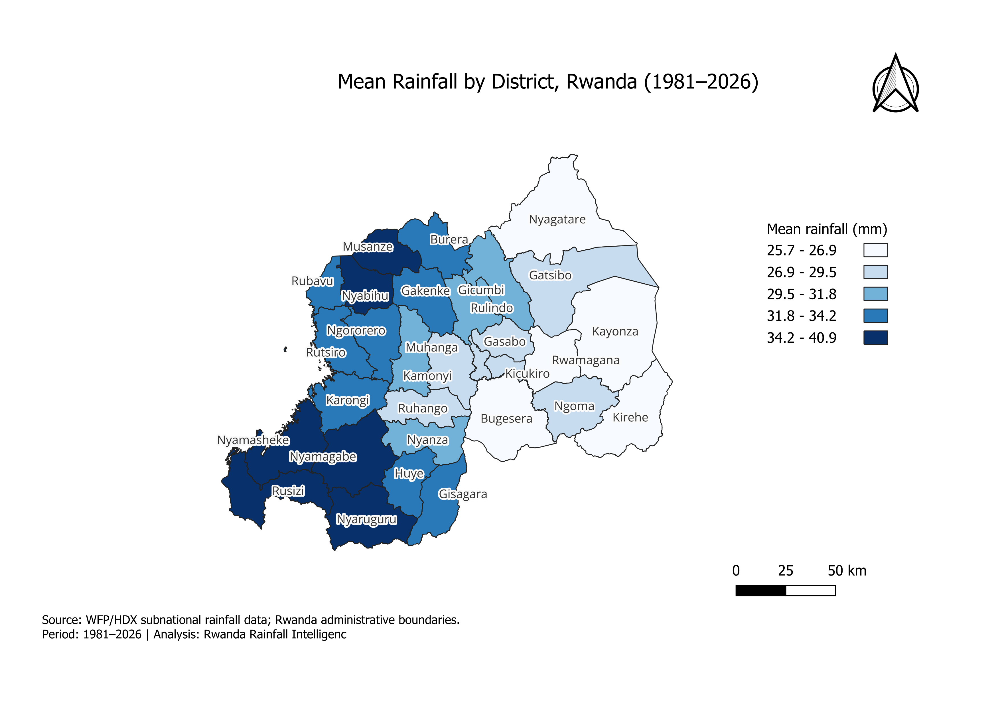

# Rwanda Rainfall Intelligence

## Project Overview

Rwanda Rainfall Intelligence is a data engineering and water-resources analytics project focused on processing, storing, analyzing, and visualizing rainfall data across Rwanda.

The project combines **Data Engineering, Water Resources Engineering, and Geospatial Analysis** to transform historical rainfall observations into reliable datasets and useful insights for water-related decision support.

## Current Status

**Phase 1–7 completed.**

The project has progressed from raw rainfall data preparation through PostgreSQL database development, ETL engineering, rainfall analysis, and GIS-based spatial visualization.

### Completed

- Data ingestion and exploratory analysis
- Data cleaning and quality validation
- Missing-value and time-series investigation
- Administrative identifier validation
- PostgreSQL database design and validation
- Reusable and idempotent ETL pipeline
- Rainfall baseline and seasonality analysis
- Long-term rainfall and anomaly analysis
- Extreme rainfall analysis
- Location-level rainfall analysis
- Rwanda administrative boundary integration
- GIS-ready district rainfall aggregation
- Rainfall-to-district spatial data join
- District rainfall choropleth mapping in QGIS
- Professional GIS map export to PDF and PNG
- Git version control and GitHub repository management

---

## Phase 6 — Rainfall Data Analysis

Phase 6 analyzed historical **final rainfall observations** to understand rainfall patterns, variability, anomalies, extremes, and spatial differences.

### Key Findings

- Dataset contains **58,536 final observations** across **36 administrative locations**.
- Historical analysis uses complete years from **1981–2025**.
- April has the highest average dekadal rainfall (**57.79 mm**) and July the lowest (**3.04 mm**).
- Historical Rwanda-wide annual rainfall baseline is approximately **1,154.11 mm/year**.
- **2000** was the strongest dry year in the anomaly analysis (**−20.13%**).
- **2018** was the strongest wet year (**+19.95%**).
- The global **99th-percentile extreme threshold is 102.70 mm per dekadal observation**.
- **586 observations** exceed this threshold.
- **RW23** has the highest frequency of 99th-percentile rainfall observations.
- **RW22** recorded the highest individual rainfall observation at **228.17 mm**.
- Extreme rainfall is concentrated mainly during **March–May**, particularly April, with a secondary concentration during **October–November**.

These findings provide a **screening-level basis** for further investigation of drainage, erosion, water-resource planning, agricultural water management, and rainfall-related risk.

The analysis does not treat dekadal rainfall as infrastructure design rainfall. Detailed flood design, IDF analysis, and return-period assessment require appropriate temporal rainfall and additional hydrological information.

### Phase 6 Analytical Outputs

```text
data/processed/
├── rwanda_rainfall_cleaned.csv
├── rainfall_yearly_anomalies.csv
├── rainfall_extreme_events.csv
└── rainfall_spatial_summary.csv
```

---

## Phase 7 — GIS & Spatial Rainfall Intelligence

Phase 7 transformed the processed rainfall data into geographic rainfall intelligence using **QGIS and Rwanda administrative boundaries**.

Rainfall statistics were connected to Rwanda's **30 districts** using administrative **PCODEs**, allowing long-term rainfall patterns to be visualized geographically.

### District Mean Rainfall Map



The final choropleth map represents **mean rainfall by district from 1981–2026** using five **Natural Breaks (Jenks)** classes.

The spatial pattern shows generally higher mean rainfall in **western and southwestern Rwanda**, while several eastern districts fall within lower mean-rainfall classes.

### GIS Processing

The source rainfall dataset contained two administrative identifiers associated with **RW36 (Rusizi)**. Because both represented rainfall aggregations with different pixel coverage, they were consolidated at PCODE and date level using **pixel-weighted rainfall aggregation** for district-level spatial analysis.

The GIS workflow follows:

```text
Cleaned Rainfall Data
        ↓
District-Level Filtering
        ↓
PCODE / Date Aggregation
        ↓
GIS-Ready District Summary
        ↓
Rwanda District Boundaries
        ↓
PCODE Spatial Join
        ↓
QGIS Choropleth Map
        ↓
PDF / PNG Map Outputs
```

### Phase 7 Outputs

```text
data/processed/
└── rainfall_district_summary.csv

src/analysis/
└── prepare_gis_summary.py

gis/
├── Rwanda_Rainfall_Intelligence.qgz
└── outputs/
    ├── Rwanda_District_Mean_Rainfall_Final.pdf
    └── Rwanda_District_Mean_Rainfall_Final.png
```

---

## PostgreSQL Database

Database:

```text
rwanda_rainfall
```

Main table:

```text
rainfall_observations
```

Primary key:

```text
(date, adm_id, version)
```

The database contains **58,680 observations** across final, preliminary, and forecast versions.

---

## ETL Pipeline

The reusable ETL pipeline follows:

```text
Raw CSV
   ↓
Extract
   ↓
Transform & Validate
   ↓
Load
   ↓
PostgreSQL
```

Files:

```text
src/etl/
├── extract.py
├── transform.py
├── load.py
└── pipeline.py
```

The pipeline processes **58,680 rows** using batch loading, staging tables, primary-key conflict protection, and idempotent execution.

Run with:

```bash
python src/etl/pipeline.py
```

---

## SQL Validation

```text
sql/
├── 01_create_rainfall_table.sql
└── 02_validate_rainfall_data.sql
```

The SQL scripts support table creation, row-count validation, administrative-location checks, duplicate detection, missing-value checks, rainfall validation, and data-version validation.

---

## Project Structure

```text
Rwanda_Rainfall_intelligence/
│
├── data/
│   ├── raw/
│   │   └── rwa-rainfall-subnat-full.csv
│   │
│   ├── processed/
│   │   ├── rwanda_rainfall_cleaned.csv
│   │   ├── rainfall_yearly_anomalies.csv
│   │   ├── rainfall_extreme_events.csv
│   │   ├── rainfall_spatial_summary.csv
│   │   └── rainfall_district_summary.csv
│   │
│   └── boundaries/
│       ├── provinces/
│       └── districts/
│
├── Notebooks/
│   ├── 01_data_exploration.py
│   └── 02_data_cleaning.py
│
├── src/
│   ├── analysis/
│   │   ├── __init__.py
│   │   ├── rainfall_baseline.py
│   │   ├── rainfall_seasonality.py
│   │   ├── rainfall_trends.py
│   │   ├── rainfall_anomalies.py
│   │   ├── rainfall_extremes.py
│   │   ├── rainfall_spatial.py
│   │   └── prepare_gis_summary.py
│   │
│   └── etl/
│       ├── extract.py
│       ├── transform.py
│       ├── load.py
│       └── pipeline.py
│
├── gis/
│   ├── Rwanda_Rainfall_Intelligence.qgz
│   └── outputs/
│       ├── Rwanda_District_Mean_Rainfall_Final.pdf
│       └── Rwanda_District_Mean_Rainfall_Final.png
│
├── sql/
├── .gitignore
├── .env
└── README.md
```

> Raw datasets, environment variables, and other sensitive or local configuration files are excluded from version control where appropriate.

---

## Project Roadmap

```text
Phase 1 — Project Setup                         ✅
Phase 2 — Data Exploration & Understanding      ✅
Phase 3 — Data Cleaning & Quality Validation    ✅
Phase 4 — Database & Data Storage               ✅
Phase 5 — ETL Pipeline                          ✅
Phase 6 — Rainfall Data Analysis                ✅
Phase 7 — GIS & Spatial Rainfall Intelligence   ✅
Phase 8 — Dashboard & Decision Support          → NEXT
Phase 9 — Productionization & Portfolio         → FUTURE
```

## Future Development

- Interactive rainfall dashboard
- Decision-support indicators
- PostGIS spatial database integration
- GeoPandas geospatial processing
- Automated data-quality monitoring
- Apache Airflow orchestration
- Apache Kafka streaming
- Docker containerization
- Rainfall forecasting and advanced hydrological analysis

## Project Vision

Rwanda Rainfall Intelligence is being developed toward a **water and environmental data intelligence platform** combining rainfall data, geospatial information, hydrological analysis, and modern data engineering for water-resource and environmental decision support.

## Author

**GATERA Emile**  
**Civil & Data Water Engineer**


