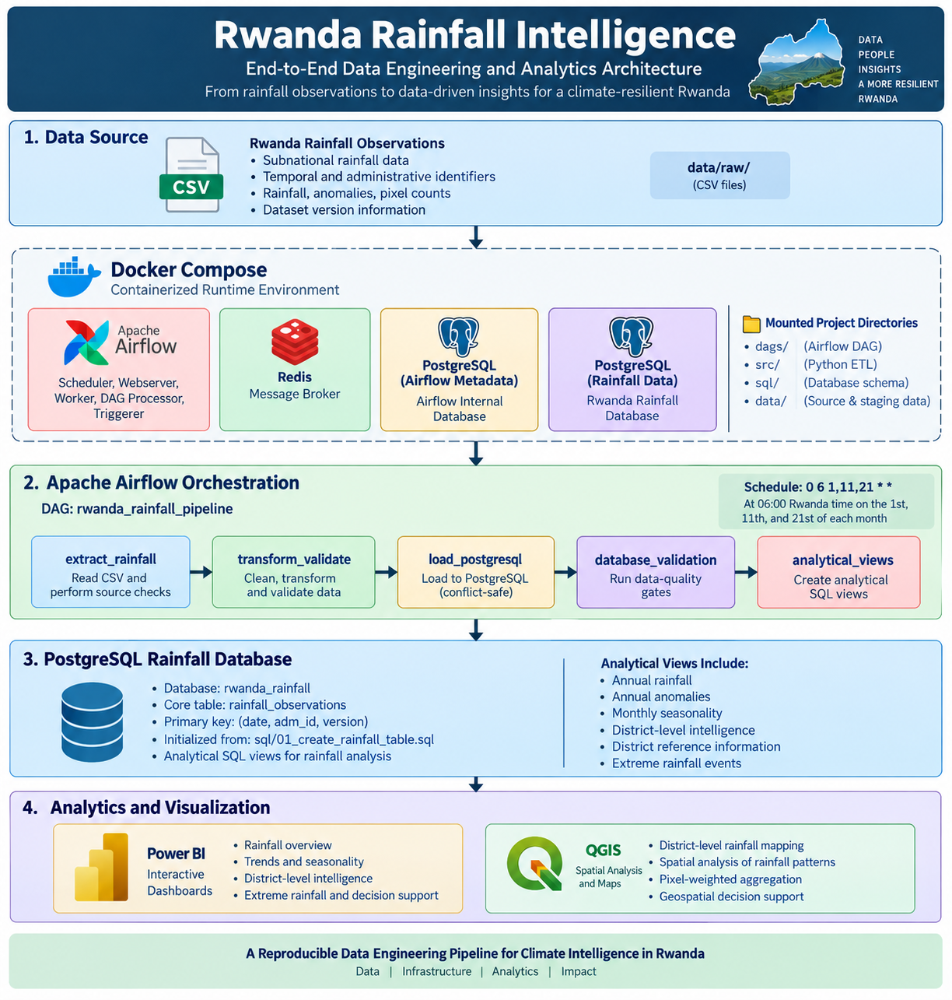
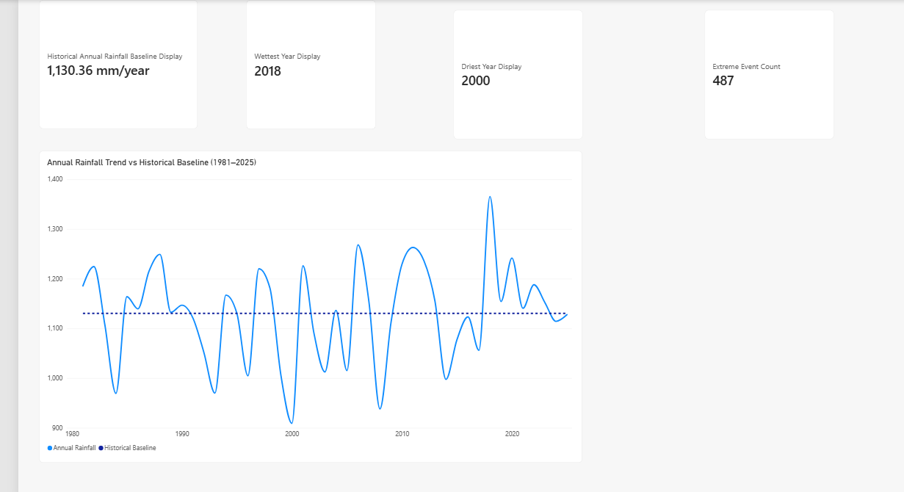
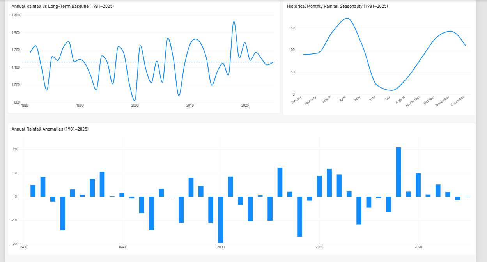
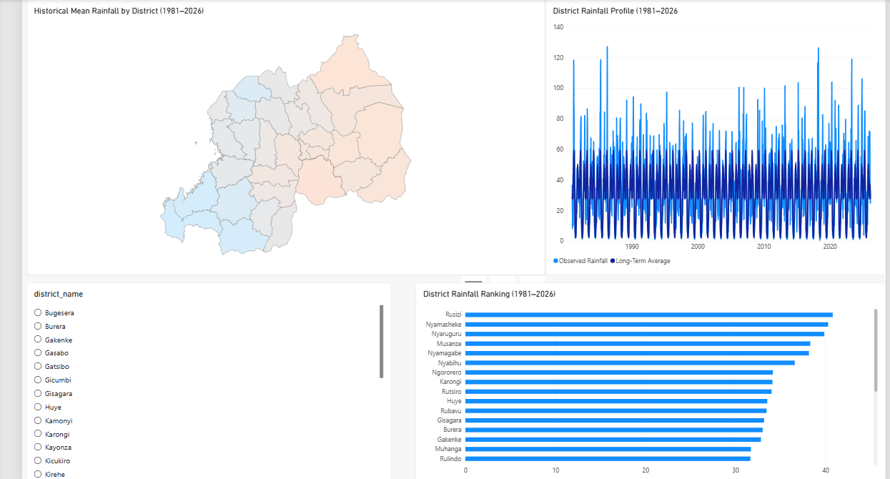
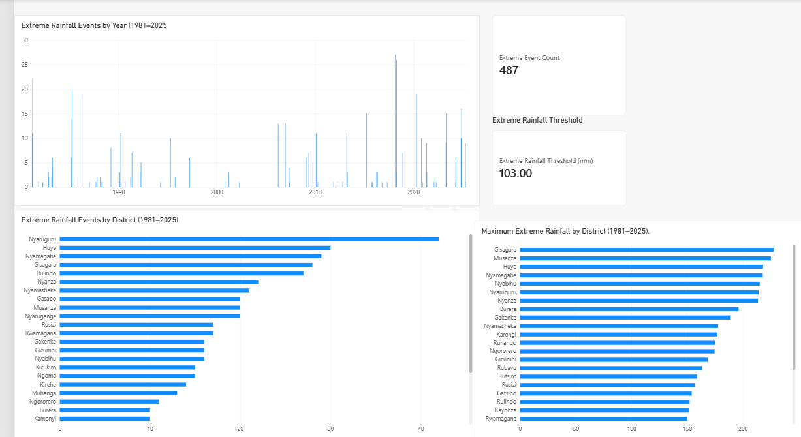

# Rwanda Rainfall Intelligence

An end-to-end **data engineering, analytics, and geospatial intelligence project** for processing, validating, storing, analyzing, and visualizing historical rainfall observations across Rwanda.

The project transforms raw subnational rainfall data into a reproducible analytical system using **Python, PostgreSQL, Apache Airflow, Docker, SQL, Power BI, QGIS, Linux/WSL 2, Git, and GitHub**.

---

## Project Overview

Rwanda Rainfall Intelligence demonstrates how rainfall observations can move through a complete data-engineering lifecycle:

**Raw Data → Validation → Transformation → Database → Orchestration → Analytics → GIS → Dashboard**

The project combines data engineering and water-resources knowledge in one system rather than treating data preparation, database engineering, spatial analysis, and visualization as separate exercises.

The completed system provides:

- Automated rainfall extraction and transformation
- Multi-stage data-quality validation
- PostgreSQL storage and analytical SQL views
- Conflict-safe and idempotent database loading
- Apache Airflow workflow orchestration
- Scheduled pipeline execution
- Retries, structured logging, and monitoring
- Dockerized Airflow and PostgreSQL infrastructure
- Persistent database storage
- Reproducible database initialization
- District-level spatial rainfall analysis
- Power BI rainfall intelligence dashboards
- QGIS rainfall mapping
- Documented production architecture

---

## System Architecture



The production workflow follows:

```text
Raw Rainfall CSV
       |
       v
Apache Airflow
       |
       v
Python ETL Pipeline
       |
       +-- Extract
       |
       +-- Transform & Validate
       |
       +-- Load
       |
       v
PostgreSQL
       |
       +-- Database Quality Validation
       |
       v
Analytical SQL Views
       |
       +-------------------+
       |                   |
       v                   v
    Power BI              QGIS
    Dashboard        Spatial Analysis
```

**Docker Compose** provides the containerized runtime for Airflow, Redis, and PostgreSQL services.

Detailed technical architecture is documented in:

[`docs/architecture.md`](docs/architecture.md)

---

## Dataset

The project uses subnational rainfall observations for Rwanda.

The source dataset contains:

- **58,680 observations**
- **1,630 dekadal timestamps**
- Coverage from **1981-01-01 to 2026-04-01**
- **5 ADM1 administrative units**
- **30 ADM2 district PCODEs**
- Rainfall observations and historical averages
- One-month and three-month rainfall accumulations
- Rainfall anomaly indicators
- Pixel counts
- Dataset version information

The main variables include:

| Variable | Description |
|---|---|
| `rfh` | Rainfall for the current dekad |
| `rfh_avg` | Historical average rainfall for the dekad |
| `r1h` | Rolling one-month rainfall |
| `r1h_avg` | Historical average one-month rainfall |
| `r3h` | Rolling three-month rainfall |
| `r3h_avg` | Historical average three-month rainfall |
| `rfq` | Dekadal rainfall anomaly indicator |
| `r1q` | One-month rainfall anomaly indicator |
| `r3q` | Three-month rainfall anomaly indicator |
| `n_pixels` | Number of raster pixels represented by the observation |
| `version` | Observation status: final, preliminary, or forecast |

The source data is stored under:

```text
data/raw/
```

Raw data is preserved separately from staging and processed outputs.

---

## Data Engineering Pipeline

The ETL implementation is located under:

```text
src/etl/
```

The production workflow is divided into five stages.

### 1. Extract

`extract.py`

The extraction stage:

- Reads the raw rainfall CSV
- Verifies the source file
- Reports dataset dimensions
- Checks temporal coverage
- Writes extracted observations to the staging area

### 2. Transform and Validate

`transform.py`

The transformation stage performs:

- Required-column validation
- Date conversion and validation
- Duplicate checks
- Rainfall-value validation
- Pixel-count validation
- Rolling rainfall consistency checks
- Standardized transformation for database loading

Expected missing values at the beginning of rolling one-month and three-month rainfall series are retained rather than artificially imputed.

### 3. Load

`load.py`

Validated observations are loaded into PostgreSQL using a temporary staging table and conflict-safe insertion.

The database primary key is:

```text
(date, adm_id, version)
```

This makes the load process **idempotent**.

Repeated pipeline execution does not duplicate existing observations. Existing primary-key combinations are skipped while new observations can be inserted.

### 4. Database Validation

`validate.py`

After loading, automated PostgreSQL quality gates verify:

- Total row count
- Duplicate primary keys
- Missing critical rainfall observations
- Negative rainfall
- Invalid pixel counts
- One-month rainfall consistency
- Three-month rainfall consistency

Critical validation failures cause the pipeline stage to fail rather than silently allowing invalid data downstream.

### 5. Analytical Views

`views.py`

The final pipeline stage creates the analytical SQL layer used for downstream rainfall intelligence and dashboard reporting.

---

## Apache Airflow Orchestration

The production workflow is orchestrated using **Apache Airflow 3.3.1**.

The DAG is:

```text
rwanda_rainfall_pipeline
```

Its dependency chain is:

```text
extract_rainfall
       |
       v
transform_validate
       |
       v
load_postgresql
       |
       v
database_validation
       |
       v
analytical_views
```

The operational schedule is:

```text
0 6 1,11,21 * *
```

This schedules processing for **06:00 Rwanda time on the 1st, 11th, and 21st of each month**.

This is the project's operational processing schedule and does not imply that the upstream rainfall provider publishes data at exactly that time.

The DAG also implements:

- Automatic task retries
- Retry delays
- Structured logging
- Task-level monitoring
- DAG-run monitoring
- Failure visibility through the Airflow interface
- Disabled catch-up execution

---

## Dockerized Runtime Environment

The production-style pipeline runs using **Docker Compose**.

The containerized environment includes:

- Airflow API server
- Airflow scheduler
- Airflow worker
- Airflow DAG processor
- Airflow triggerer
- Redis
- PostgreSQL for Airflow metadata
- PostgreSQL for Rwanda rainfall data

The Airflow metadata database and rainfall database are intentionally separated.

This prevents orchestration metadata from being mixed with project analytical data.

### Linux Environment

Development is performed primarily from Windows and Visual Studio Code, while the production-style runtime uses:

```text
Windows
   |
   v
Docker Desktop
   |
   v
WSL 2
   |
   v
Linux Containers
   |
   +-- Apache Airflow
   +-- PostgreSQL
   +-- Redis
   +-- Python ETL
```

This provides practical experience with a Linux-based container environment while retaining Windows as the development workstation.

### Database Persistence

The rainfall PostgreSQL database uses a persistent Docker volume.

Container recreation therefore does not remove stored rainfall observations.

### Reproducible Initialization

The rainfall database schema is defined in:

```text
sql/01_create_rainfall_table.sql
```

For a fresh PostgreSQL Docker volume, the schema initialization script is mounted into:

```text
/docker-entrypoint-initdb.d/
```

The schema uses:

```sql
CREATE TABLE IF NOT EXISTS rainfall_observations
```

making schema creation safe and reproducible.

---

## Data Quality and Reliability

Data quality is enforced at several layers:

```text
Raw Source
    |
    v
Extraction Checks
    |
    v
Transformation Validation
    |
    v
PostgreSQL Constraints
    |
    v
Database Quality Gates
    |
    v
Analytical Views
```

The final validated PostgreSQL dataset contains:

| Validation | Result |
|---|---:|
| Total observations | 58,680 |
| Unique primary keys | 58,680 |
| Duplicate keys | 0 |
| Missing critical `rfh` values | 0 |
| Negative rainfall values | 0 |
| Invalid pixel counts | 0 |
| Inconsistent one-month rainfall | 0 |
| Inconsistent three-month rainfall | 0 |

Expected early-series missing values in rolling rainfall variables are retained because sufficient preceding observations do not yet exist to calculate those accumulations.

---

## PostgreSQL and Analytical SQL Layer

The main rainfall database is:

```text
rwanda_rainfall
```

The core table is:

```text
rainfall_observations
```

The primary key is:

```text
(date, adm_id, version)
```

The analytical layer includes:

```text
vw_district_rainfall
vw_district_dimension
vw_annual_rainfall
vw_annual_rainfall_anomalies
vw_monthly_seasonality
vw_extreme_rainfall_events
```

These views provide reusable datasets for district rainfall, annual rainfall, anomalies, seasonality, administrative reference information, and extreme-rainfall analysis.

The SQL implementation is maintained under:

```text
sql/
├── 01_create_rainfall_table.sql
├── 02_validate_rainfall_data.sql
└── 03_create_dashboard_views.sql
```

This design separates persistent observation storage from analysis-ready representations.

---

## Rainfall Intelligence

Historical rainfall analysis was conducted primarily on complete **final observations from 1981–2025**.

The analysis investigates:

- Long-term annual rainfall patterns
- Interannual rainfall variability
- Seasonal rainfall behavior
- Historical rainfall anomalies
- Extreme rainfall observations
- District-level spatial differences

Under the original Phase 6 historical methodology:

- Long-term mean annual rainfall was approximately **1,154.11 mm/year**
- **April** had the highest average dekadal rainfall at approximately **57.79 mm**
- **July** had the lowest at approximately **3.04 mm**
- **2018** had the strongest positive annual anomaly
- **2000** had the strongest negative annual anomaly
- The original raw-observation 99th-percentile threshold was approximately **102.70 mm**
- **586 raw observations** exceeded that threshold

The later district-weighted analytical layer used by the dashboard produces a long-term national baseline of approximately:

**1,130.36 mm/year**

The difference is methodological rather than a data-quality error.

The original historical analysis operates on the source administrative rainfall observations, while the final dashboard layer consolidates observations to Rwanda's 30 districts using pixel-weighted aggregation.

Extreme-rainfall indicators in this project are intended for **screening and historical intelligence**.

They should not be interpreted as flood-disaster records, infrastructure design rainfall, IDF curves, or return-period estimates.

---

## GIS and Spatial Intelligence

The GIS component connects rainfall observations to Rwanda's administrative boundaries.

Boundary data includes:

- **5 provinces**
- **30 districts**

District boundaries are maintained under:

```text
data/boundaries/district/
```

Province boundaries are maintained under:

```text
data/boundaries/provinces/
```

District-level rainfall analysis uses **pixel-weighted aggregation**:

```text
weighted rainfall = Σ(rfh × n_pixels) / Σ(n_pixels)
```

This accounts for the number of rainfall-grid pixels represented by each observation.

### RW36 Administrative Mapping

The source rainfall dataset contains two administrative identifiers associated with district PCODE `RW36`.

Rather than arbitrarily deleting one identifier, observations are consolidated at PCODE and date level using pixel-weighted aggregation.

This creates one consistent district-level analytical series.

### GIS Output


The final QGIS project is stored at:

```text
gis/Rwanda_Rainfall_Intelligence.qgz
```

Map exports are available under:

```text
gis/outputs/
```

---

## Power BI Dashboard

The project includes a four-page **Power BI rainfall intelligence and decision-support dashboard**.

The reporting layer uses PostgreSQL analytical views rather than performing the principal analytical transformations directly from the raw CSV.

### Page 1 — Rainfall Overview



Provides headline rainfall indicators and historical rainfall context.

### Page 2 — Trends & Seasonality



Examines annual rainfall, historical anomalies, and Rwanda's seasonal rainfall cycle.

### Page 3 — District Intelligence



Provides district-level rainfall comparison and spatial context across Rwanda's 30 districts.

### Page 4 — Extreme & Decision Support



Provides screening-level extreme-rainfall indicators, affected districts, temporal patterns, and decision-support context.

The Power BI project is stored at:

```text
dashboards/Rwanda_Rainfall_Intelligence.pbix
```

A PDF export is available at:

```text
dashboards/export/Rwanda_Rainfall_Intelligence.pdf
```

---

## Validated Dashboard Indicators

The principal Power BI indicators were independently checked against the PostgreSQL analytical layer.

| Indicator | Validated Value |
|---|---:|
| Historical annual rainfall baseline | 1,130.36 mm/year |
| Wettest year | 2018 |
| Wettest annual rainfall | 1,365.46 mm |
| Driest year | 2000 |
| Driest annual rainfall | 909.01 mm |
| Extreme rainfall threshold | 103.00 mm |
| Extreme district observations | 487 |
| Rusizi mean dekadal rainfall | ~40.82 mm |

These indicators correspond to the dashboard's district-weighted analytical methodology.

---

## Technology Stack

### Data Engineering

- Python
- pandas
- SQLAlchemy
- psycopg2
- PostgreSQL
- SQL

### Workflow Orchestration & Containers

- Apache Airflow 3.3.1
- Docker
- Docker Compose
- Redis
- CeleryExecutor

### Operating Environment

- Windows
- WSL 2
- Ubuntu
- Linux-based Docker containers

### Geospatial Analysis

- QGIS
- GeoPandas
- GeoJSON
- ESRI Shapefile

### Analytics & Visualization

- Microsoft Power BI
- DAX
- Matplotlib

### Development & Version Control

- Visual Studio Code
- Git
- GitHub

### Engineering Domain

- Water Resources Engineering
- Rainfall analysis
- Spatial rainfall intelligence
- Environmental decision support

---

## Project Structure

```text
Rwanda_Rainfall_intelligence/
|
├── airflow/
│   └── dags/
│       └── rwanda_rainfall_pipeline_dag.py
│
├── dashboards/
│   ├── Rwanda_Rainfall_Intelligence.pbix
│   └── export/
│       ├── 01_Rainfall_overview.png
│       ├── 02_Trends_Seasonality.png
│       ├── 03_District_Intelligence.png
│       ├── 04_Extreme_Decision_Support.png
│       └── Rwanda_Rainfall_Intelligence.pdf
│
├── data/
│   ├── raw/
│   │   └── rwa-rainfall-subnat-full.csv
│   ├── processed/
│   └── boundaries/
│       ├── district/
│       └── provinces/
│
├── docs/
│   ├── architecture.md
│   └── architecture_diagram.png
│
├── gis/
│   ├── Rwanda_Rainfall_Intelligence.qgz
│   └── outputs/
│       ├── Rwanda_District_Mean_Rainfall_Final.pdf
│       └── Rwanda_District_Mean_Rainfall_Final.png
│
├── Notebooks/
│   ├── 01_data_exploration.py
│   └── 02_data_cleaning.py
│
├── sql/
│   ├── 01_create_rainfall_table.sql
│   ├── 02_validate_rainfall_data.sql
│   └── 03_create_dashboard_views.sql
│
├── src/
│   ├── analysis/
│   │   ├── rainfall_baseline.py
│   │   ├── rainfall_seasonality.py
│   │   ├── rainfall_trends.py
│   │   ├── rainfall_anomalies.py
│   │   ├── rainfall_extremes.py
│   │   ├── rainfall_spatial.py
│   │   └── prepare_gis_summary.py
│   │
│   └── etl/
│       ├── extract.py
│       ├── transform.py
│       ├── load.py
│       ├── pipeline.py
│       ├── validate.py
│       └── views.py
│
├── .env.example
├── .gitignore
├── docker-compose.yaml
└── README.md
```

Temporary staging outputs, virtual environments, runtime logs, local secrets, and other machine-specific files should remain outside version control.

---

## Running the Production Environment

### Prerequisites

The containerized environment requires:

- Git
- Docker Desktop
- Docker Compose
- WSL 2 / Linux container support on Windows

Clone the repository:

```bash
git clone https://github.com/gateraemile250-eng/Rwanda_Rainfall_intelligence.git
cd Rwanda_Rainfall_intelligence
```

Create your local environment configuration from:

```text
.env.example
```

For example, on Windows:

```bat
copy .env.example .env
```

Replace the placeholder values in `.env` with secure local configuration.

**Never commit the real `.env` file.**

Validate the Docker Compose configuration:

```bash
docker compose config --quiet
```

Start the services:

```bash
docker compose up -d
```

Check container health:

```bash
docker compose ps
```

The Airflow interface is exposed locally on port:

```text
8080
```

The production DAG is:

```text
rwanda_rainfall_pipeline
```

A manual pipeline run can be triggered with:

```bash
docker compose exec airflow-scheduler airflow dags trigger rwanda_rainfall_pipeline
```

Scheduled execution occurs only while the local Docker/Airflow environment is running.

---

## Pipeline Validation

Airflow DAG import errors can be checked with:

```bash
docker compose exec airflow-scheduler airflow dags list-import-errors
```

Database quality validation can be executed inside the Airflow runtime with:

```bash
docker compose exec airflow-worker python /opt/airflow/project/src/etl/validate.py
```

The final end-to-end production test confirmed:

```text
58,680 database rows
58,680 unique primary keys
0 duplicate keys
0 critical quality failures
```

A repeated production pipeline run processed the same **58,680 input observations** and reported:

```text
Inserted: 0
Skipped: 58,680
```

while the database remained at:

```text
58,680 rows
```

This demonstrates idempotent loading when the source dataset has not changed.

---

## Source Update Workflow

The current project uses a **batch-oriented source workflow**.

When a newer rainfall CSV becomes available, the source file can be updated at the configured raw-data location and the Airflow DAG can process it during the next scheduled or manually triggered run.

Airflow orchestrates processing; it does not continuously watch the source directory for file changes.

This batch architecture is appropriate for the current rainfall-data workflow and avoids introducing streaming infrastructure where it is not required.

---

## Environment and Secret Management

Runtime database and Airflow configuration is supplied through environment variables.

The local file:

```text
.env
```

contains sensitive configuration and is excluded from Git.

The repository instead provides:

```text
.env.example
```

with safe placeholder values documenting the variables required to reproduce the environment.

Passwords, Fernet keys, and other secrets must never be committed to the repository.

---

## Production Validation

The complete containerized workflow was tested through a normal Airflow DAG run.

The test verified:

```text
Docker services healthy
        |
        v
Airflow DAG triggered
        |
        v
Extract succeeded
        |
        v
Transform & Validate succeeded
        |
        v
PostgreSQL Load succeeded
        |
        v
Database Validation succeeded
        |
        v
Analytical Views succeeded
        |
        v
58,680 valid database observations
```

All five DAG tasks completed successfully.

This validates the integration between **Docker, Airflow, Python ETL, PostgreSQL, automated data-quality checks, and the analytical SQL layer**.

---

## Engineering Design Principles

The project was developed around several core engineering principles.

**Reproducibility**
Infrastructure configuration, database initialization, environment templates, pipeline code, SQL, and documentation are maintained with the project.

**Data Quality**
Validation occurs during data preparation, transformation, database loading, and post-load verification.

**Idempotency**
Repeated ETL execution does not create duplicate rainfall observations.

**Separation of Concerns**
Extraction, transformation, loading, validation, orchestration, storage, analytics, GIS, and visualization have distinct responsibilities.

**Persistence**
PostgreSQL data is protected using Docker volumes.

**Observability**
Airflow provides task status, execution history, retries, and logs.

**Security Awareness**
Secrets are separated from version-controlled configuration through environment variables and `.gitignore`.

---

## Project Status

### Phase 1 — Project Setup
**Complete**

### Phase 2 — Data Exploration & Understanding
**Complete**

### Phase 3 — Data Cleaning & Quality Validation
**Complete**

### Phase 4 — Database & Data Storage
**Complete**

### Phase 5 — ETL Pipeline
**Complete**

### Phase 6 — Rainfall Data Analysis
**Complete**

### Phase 7 — GIS & Spatial Rainfall Intelligence
**Complete**

### Phase 8 — Dashboard & Decision Support
**Complete**

### Phase 9 — Productionization & Portfolio
**Complete**

The project has progressed from raw rainfall observations to a **containerized, orchestrated, validated, and documented data-engineering and rainfall-intelligence system**.

---

## Documentation

Detailed technical architecture:

[`docs/architecture.md`](docs/architecture.md)

Architecture diagram:

[`docs/architecture_diagram.png`](docs/architecture_diagram.png)

The repository also contains SQL validation scripts, ETL modules, rainfall-analysis scripts, GIS outputs, Power BI exports, and Airflow orchestration code documenting the major stages of the system.

---

## Scope and Future Extensions

The current implementation is a **local production-style portfolio system** rather than a cloud-hosted production service.

Potential future extensions include:

- Cloud deployment
- Automated upstream data acquisition
- CI/CD pipeline testing
- PostGIS integration
- Additional hydrological datasets
- Rainfall forecasting
- Flood-risk datasets and hydrological modeling
- Infrastructure-focused rainfall decision support

Technologies such as streaming platforms should be introduced only when the source-data frequency and operational requirements justify them.

---

## Author

**GATERA Emile**

**Civil & Water Resources Engineer | Data Engineering | GIS | Water Data Intelligence**

Rwanda

---

## Project Vision

Rwanda Rainfall Intelligence demonstrates how **data engineering, water-resources knowledge, geospatial analysis, and business intelligence** can be integrated into a reproducible rainfall intelligence system.

The project serves both as a technical portfolio and as a foundation for future applications in **water resources, environmental monitoring, infrastructure planning, hydrological analysis, and climate-related data intelligence**.


